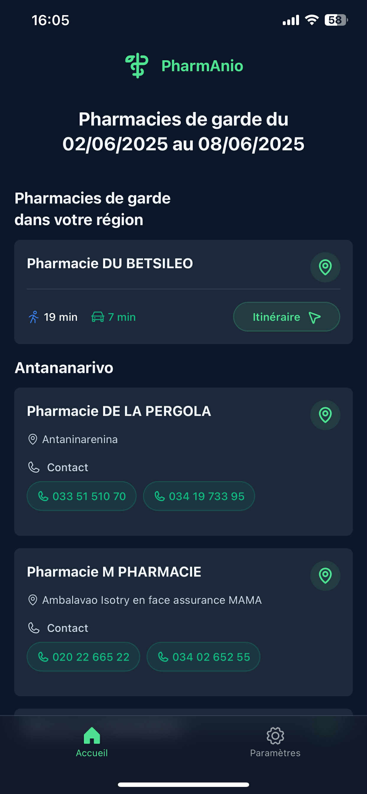
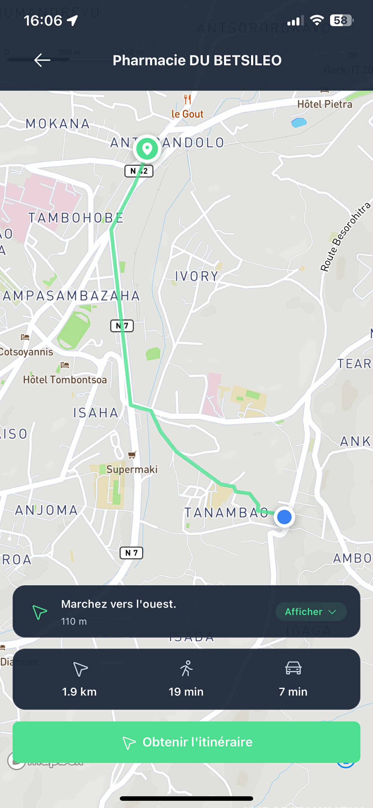
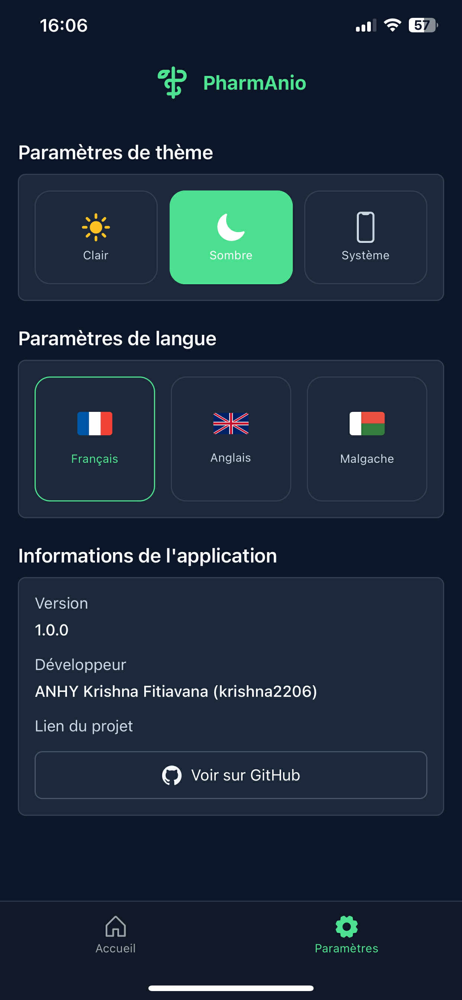

#  PharmAnio

**PharmAnio** is a mobile application designed to help users find pharmacies on duty in Madagascar. The app provides real-time information about currently available pharmacies and offers route guidance from the user's current location to the selected pharmacy.

## 🌟 Features

- **Real-time Pharmacy Listings**: View pharmacies currently on duty with up-to-date information
- **Location-based Services**: Find pharmacies near your current location
- **Interactive Maps**: Navigate to pharmacies with turn-by-turn directions powered by Mapbox
- **Multi-language Support**: Available in French, English, and Malagasy
- **Dark/Light Theme**: Automatic theme switching with manual override options
- **Contact Integration**: Direct phone calling to pharmacy numbers
- **Offline-ready Architecture**: Robust error handling and graceful degradation

## 📱 Screenshots

| Home Screen | Map Navigation | Settings |
|-------------|---------------|----------|
|  |  |  |

## 🛠 Tech Stack

- **React Native** with Expo SDK ~53.0.9
- **TypeScript** with strict mode
- **Expo Router** for navigation
- **NativeWind** (TailwindCSS for React Native)
- **Mapbox** for maps and routing
- **Zustand** for state management
- **Phosphor Icons** for UI icons

## 🚀 Project Setup

### Prerequisites

- Node.js (version 18 or higher)
- npm or yarn
- Expo CLI
- iOS Simulator (for iOS development)
- Android Studio/Emulator (for Android development)

### 1. Clone the Repository

```bash
git clone https://github.com/krishna2206/pharmanio.git
cd pharmanio
```

### 2. Install Dependencies

```bash
yarn install
```

### 3. Setup Mapbox Integration

1. Create a Mapbox account at [mapbox.com](https://www.mapbox.com)
2. Generate access tokens:
   - **Public token**: For client-side map rendering
   - **Download token**: For downloading map data and styles

### 4. Configure Environment Variables

Create a `.env` file in the root directory:

```env
EXPO_PUBLIC_API_URL=your_api_url_here
EXPO_PUBLIC_MAPBOX_ACCESS_TOKEN=your_mapbox_public_token_here
EXPO_PUBLIC_MAPBOX_DOWNLOAD_TOKEN=your_mapbox_download_token_here
```

### 5. Start Development

```bash
# Start the development server
npx expo start

# Run on specific platforms
npx expo run:ios     # iOS
npx expo run:android # Android
```

## 🚀 Deployment

### Development Build
```bash
# Create development build
eas build --profile development

# Install on device
eas build --profile development --platform ios --local
```

### Production Build
```bash
# Build for app stores
eas build --profile production

# Submit to stores
eas submit --platform ios
eas submit --platform android
```

## 🤝 Contributing

1. Fork the repository
2. Create a feature branch (`git checkout -b feature/amazing-feature`)
3. Commit your changes (`git commit -m 'Add amazing feature'`)
4. Push to the branch (`git push origin feature/amazing-feature`)
5. Open a Pull Request

---

<p align="center">
    <strong>Made with ❤️ for the people of Madagascar 🇲🇬</strong>
</p>